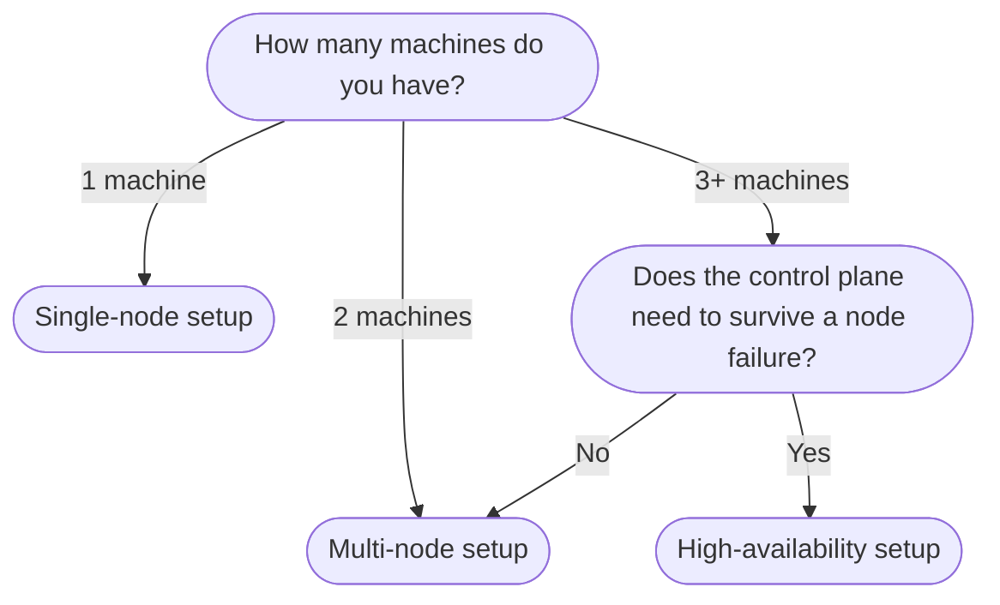

# Install K3S

**Required.**

K3S is a lightweight, certified Kubernetes distribution that packages containerd, CoreDNS, flannel CNI, a local-path storage provisioner, and a load balancer into a single binary under 100MB. It is purpose-built for resource-constrained hardware and passes the full Kubernetes conformance test suite, meaning everything that works in standard Kubernetes also works in K3S.

> **Reference:** [K3S Quick-Start Guide](https://docs.k3s.io/quick-start)

---

## Which setup path should I use?

| Setup | Machines | Description |
|---|---|---|
| [Single-node](single-node.md) | 1 | Control plane and workloads on one machine. Simplest path. |
| [Multi-node](mutli-node.md) | 2+ | One server node, one or more agent nodes. |
| [High-availability](ha-setup.md) | 3+ servers | Embedded etcd across 3 server nodes. Tolerates 1 control plane failure. |

> [!TIP]
> Not sure? Start with single-node. You can add agent nodes later without reinstalling, and migrate to HA when you actually need it.
