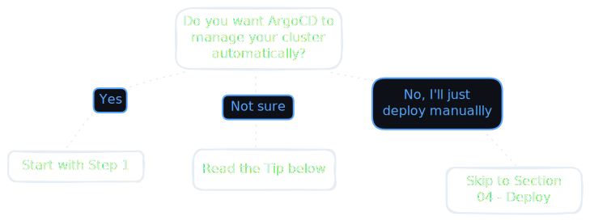

# GitOps

This section introduces GitOps and sets up ArgoCD to manage your cluster. Instead of running `kubectl apply` by hand, you commit to a git repository and the cluster reconciles itself to match.

The full GitOps setup is recommended but not required. If you prefer to deploy manually, you can skip ArgoCD entirely and still follow everything in 04-deploy.

---

## Do I need this section?

    

> [!TIP]
> Not sure if you want GitOps? Read [what-is-gitops.md](what-is-gitops.md) first. It's short and explains the tradeoffs clearly. You can always add ArgoCD later.

---

## Files in this section

| Step | File | Required? |
|---|---|---|
| 1 | [What is GitOps and why use it](what-is-gitops.md) | Read before deciding |
| 2 | [Understanding Kustomize](understanding-kustomize.md) | Required if using ArgoCD |
| 3 | [Create in-cluster secrets](cluster-secrets.md) | Required before ArgoCD syncs anything |
| 4 | [Bootstrap ArgoCD](bootstrap-argocd.md) | Required if using GitOps |
| 5 | [App of apps pattern](app-of-apps.md) | Required if using GitOps |

> [!NOTE]
> Secrets (step 3) must exist in the cluster before ArgoCD starts syncing. If you bootstrap ArgoCD first and secrets are missing, pods will fail immediately on first sync. Do step 3 before step 4.
