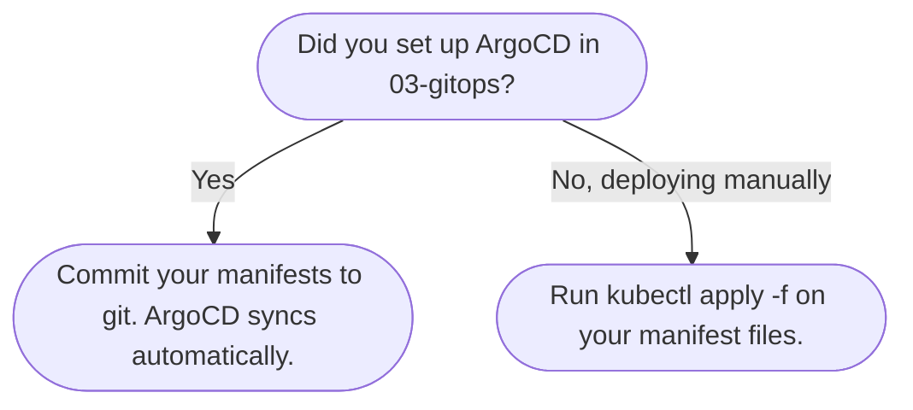

# Deploy

This section puts everything together. You will write the Kubernetes manifests that describe your app, then deploy it end-to-end and verify it is live at a real URL.

Both files work regardless of whether you are using GitOps or deploying manually with `kubectl apply`.

---

| Step | File | Notes |
|---|---|---|
| 1 | [Writing your first app manifests](writing-manifests.md) | Required - covers Deployment, Service, Ingress, and security context |
| 2 | [Deploying your first app end-to-end](first-app.md) | Required - walks through the full deploy flow with a working example |

---

## Which deploy path should I use?

> [!NOTE]
> Both paths are covered in [first-app.md](first-app.md). If you skipped ArgoCD, there is a callout at the top of that file with the manual apply command so you do not need to read through the GitOps steps.
